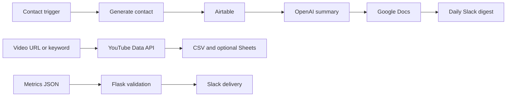

# OpsLabs Developer Assessment

A three-part automation assessment covering contact enrichment, YouTube metadata collection, and Slack reporting. The repository is public; the tested source bundle is downloadable at the repository root as `opslabs-developer-assessment.zip`.

## Project overview

- **Task 1:** Make.com workflow specification for synthetic contact generation, Airtable storage, OpenAI company summaries, Google Docs reports, and a 07:00 Slack digest.
- **Task 2:** Python collector using the official YouTube Data API v3, with CSV output and optional Google Sheets append.
- **Task 3:** Flask webhook that validates weekly metrics and sends them to Slack using an incoming webhook or bot token.

## Architecture



Task 1 and the Make path for Task 3 are specifications only; they are not imported or activated Make scenarios. Recreate them in your Make organization and connect its account-specific services before running live workflows.

## Folder structure

The root package archive expands to `assessment/` with `task1_make_automation/`, `task2_youtube_scraper/`, `task3_slack_bot/`, `shared/`, `tests/`, and `docs/`. It includes the report template, sample CSV, Make specifications, webhook payload, architecture diagram, and documentation.

## Setup

1. Install Python 3.11 or later and create a virtual environment.
2. Install dependencies with `python -m pip install -r requirements.txt`.
3. Copy `.env.example` to `.env` and fill only the values needed for the services you configure. Never commit `.env`.
4. For Make scenarios, store credentials in Make managed connections and follow `task1_make_automation/README.md` plus `docs/13-DEPLOYMENT.md` in the extracted bundle.

## Environment variables

`YOUTUBE_API_KEY`, `GOOGLE_SERVICE_ACCOUNT_JSON` (path to service-account JSON), `GOOGLE_SHEETS_SPREADSHEET_ID`, `GOOGLE_SHEETS_WORKSHEET`, `WEBHOOK_SECRET`, and either `SLACK_WEBHOOK_URL` or `SLACK_BOT_TOKEN` plus `SLACK_CHANNEL_ID`. Airtable and OpenAI credentials are placeholders for Make-managed connections; do not put secrets in a blueprint.

## How to run

From the extracted project root:

```sh
python -m task2_youtube_scraper.scraper --query "python automation" --max-results 10 --csv task2_youtube_scraper/output.csv
python -m task2_youtube_scraper.scraper --url "https://youtu.be/VIDEO_ID" --csv task2_youtube_scraper/output.csv
python -m task3_slack_bot.slack_bot
python -m unittest discover -s tests -v
```

Task 2 needs a YouTube API key. Task 3 needs a webhook secret and Slack delivery configuration. Eight offline tests cover validation and mocked delivery; they do not verify third-party services.

## Screenshots and Loom

Screenshots of live Make runs and service outputs are pending account configuration. The Loom walkthrough has not yet been recorded. Do not treat the sample CSV as live API data.

## GitHub

Public repository: [github.com/RonitRB/opslabs-developer-assessment](https://github.com/RonitRB/opslabs-developer-assessment)
